# MaskBench - 面向口罩识别任务的多模型对比实验平台

[](https://www.python.org/)
[](https://pytorch.org/)
[](https://flask.palletsprojects.com/)
[](LICENSE)

MaskBench 是一个面向口罩佩戴识别任务的实验平台，提供统一的数据准备、分类训练、离线评估、Web 可视化演示和少样本扩展流程。项目适用于模型横向对比、实验复现、轻量部署验证和视觉识别场景展示。

## 目录

- [项目概述](#项目概述)
- [核心特性](#核心特性)
- [项目流程](#项目流程)
- [系统架构](#系统架构)
- [界面与结果展示](#界面与结果展示)
- [快速开始](#快速开始)
- [项目结构](#项目结构)
- [环境与依赖](#环境与依赖)
- [配置说明](#配置说明)
- [分类训练](#分类训练)
- [评估与推理](#评估与推理)
- [Web 演示系统](#web-演示系统)
- [知识蒸馏](#知识蒸馏)
- [少样本实验](#少样本实验)
- [实验结果说明](#实验结果说明)
- [文档资源](#文档资源)
- [输出目录说明](#输出目录说明)
- [扩展实验建议](#扩展实验建议)
- [后续优化方向](#后续优化方向)
- [注意事项](#注意事项)

## 项目概述

项目围绕口罩佩戴识别任务构建，包含以下核心模块：

- 多模型分类实验：统一支持 `custom_resnet18`、`resnet18`、`resnet34`、`vgg16`、`googlenet`
- 知识蒸馏 (KD)：以大模型（Teacher）指导轻量级小模型（Student），在不增加推理参数量的前提下提升精度
- 离线评估与推理：支持测试集评估、单张图片预测和结果导出
- Web 可视化演示：基于 `Flask` 提供在线评测、模型切换和结果看板
- 少样本扩展实验：基于 `Prototypical Networks` 进行新场景快速适配

该项目适合用于：

- 口罩识别任务的基线构建与复现
- 多模型性能对比与消融分析
- 教学实验与项目展示
- 轻量级视觉识别系统验证

## 核心特性

- 提供统一的训练、评估、推理和可视化演示流程
- 支持多种主流 CNN 骨干网络的横向对比
- 单次图片上传即可对当前已加载的所有模型并行推理并返回对比结果
- 自动输出训练曲线、混淆矩阵、指标文件和权重文件
- 支持在线评测看板、模型排行榜和样本级复盘分析
- 提供知识蒸馏模块，以 Teacher-Student 范式实现模型压缩与知识迁移
- 提供 ProtoNet 少样本实验，便于扩展到新场景与新类别

## 项目流程

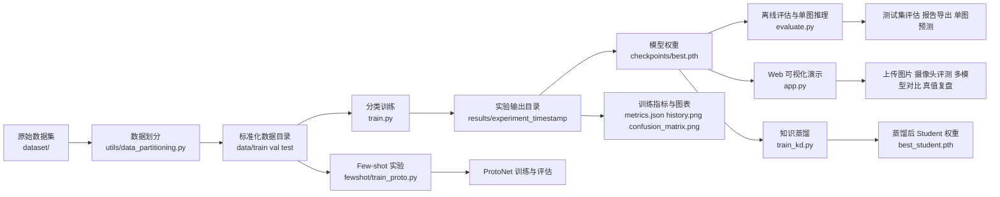

## 系统架构

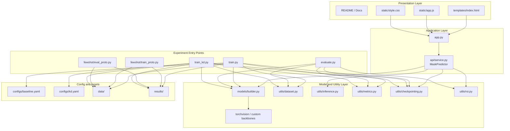

## 界面与结果展示

项目提供面向实验对比和在线演示的可视化页面，覆盖首页引导、在线评测、排行榜统计、模型卡片分析和样本复盘等场景。为避免 README 过长，默认展示关键页面，更多细节截图收纳在折叠面板中。

### Web 首页

<p align="center">
  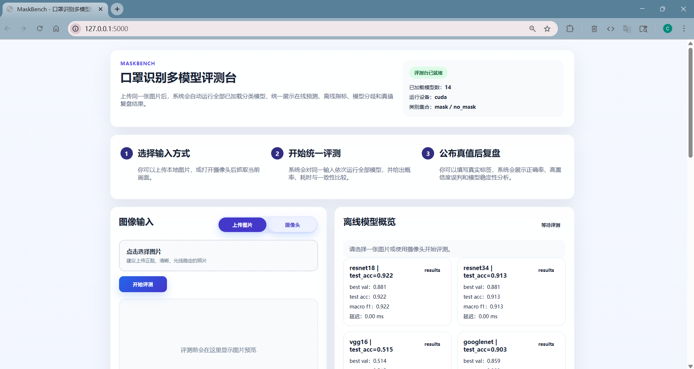
</p>

### 关键工作流界面

<p align="center">
  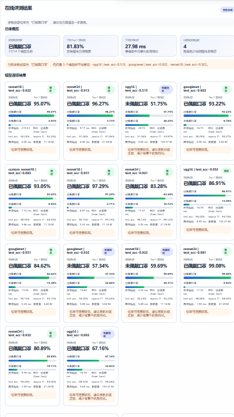
  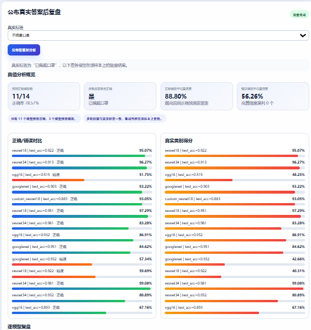
</p>

### 训练与评估可视化

<p align="center">
  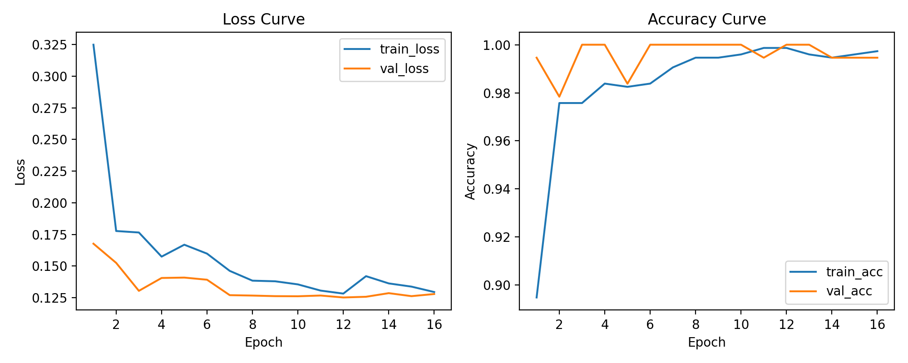
  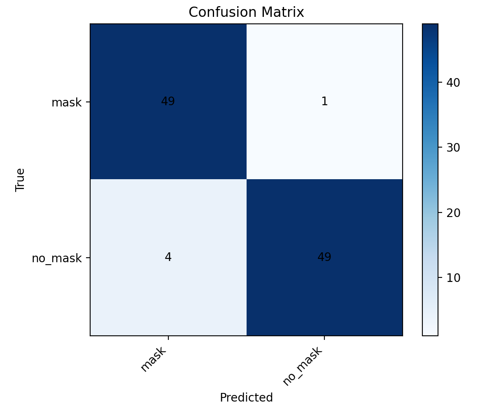
</p>

<details>
  <summary>展开查看排行榜、耗时统计、投票分布和模型卡片</summary>

  <p align="center">
    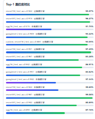
    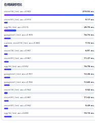
    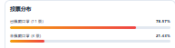
  </p>

  <p align="center">
    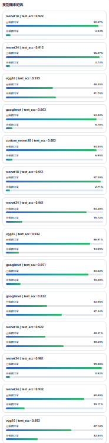
    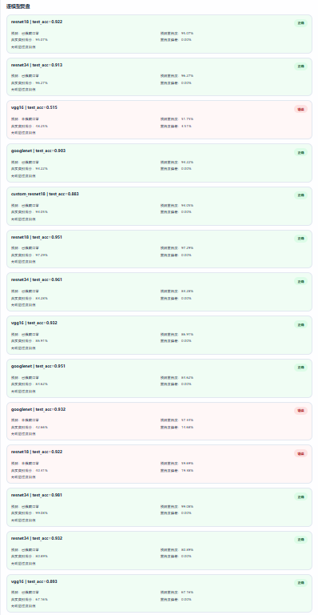
  </p>
</details>

## 快速开始

### 1. 获取项目代码

```bash
git clone <repository-url>
cd MaskBench
```

### 2. 创建虚拟环境并安装依赖

```bash
python -m venv .venv
```

Windows:

```bash
.venv\Scripts\activate
```

macOS / Linux:

```bash
source .venv/bin/activate
```

安装依赖：

```bash
pip install -r requirements.txt
```

### 3. 准备数据集

将原始二分类数据整理为以下目录结构：

```text
dataset/
├── mask/
└── no_mask/
```

执行数据划分脚本：

```bash
python utils/data_partitioning.py --source-root dataset --output-root data --test-ratio 0.1
```

训练与评估阶段推荐使用以下目录结构：

```text
data/
├── train/
│   ├── mask/
│   └── no_mask/
├── val/
│   ├── mask/
│   └── no_mask/
└── test/
    ├── mask/
    └── no_mask/
```

若未显式提供 `val/` 目录，程序可按配置从训练集自动划分验证集。

### 4. 训练模型

```bash
python train.py --config configs/baseline.yaml --model resnet34
```

训练完成后，输出结果默认保存在 `results/<experiment_name>_<timestamp>/`。

### 5. 评估模型或执行单图预测

```bash
python evaluate.py --model resnet34 --weights results/<experiment_name>/checkpoints/best.pth
python evaluate.py --model resnet34 --weights results/<experiment_name>/checkpoints/best.pth --image data/test/mask/example.jpg
```

### 6. 启动 Web 演示

```bash
python app.py
```

默认访问地址：

- `http://127.0.0.1:5000/`

## 项目结构

```text
MaskBench/
├── app.py                      # Flask 演示系统入口
├── train.py                    # 分类训练入口
├── train_kd.py                 # 知识蒸馏训练入口（Teacher → Student）
├── evaluate.py                 # 分类评估与单图预测入口
├── model_train.py              # 训练别名入口
├── requirements.txt            # 依赖列表
├── configs/
│   ├── baseline.yaml           # 默认训练配置
│   └── kd.yaml                 # 知识蒸馏训练配置
├── models/                     # 分类模型构建
├── utils/                      # 数据处理、指标、权重保存等工具
├── api/                        # Web 推理接口
├── fewshot/                    # ProtoNet 少样本实验
├── templates/                  # Web 页面模板
├── static/                     # 前端静态资源
├── docs/
│   └── images/                 # README 截图预留目录
└── results/                    # 训练和评估输出目录
```

## 环境与依赖

项目依赖定义在 `requirements.txt` 中，核心组件包括：

- `torch`
- `torchvision`
- `Flask`
- `opencv-python-headless`
- `matplotlib`
- `PyYAML`

建议在独立虚拟环境中运行，以避免不同项目之间的依赖冲突。

## 配置说明

默认配置文件为 `configs/baseline.yaml`，用于统一管理模型、数据处理、训练和推理参数。

常用配置项包括：

- `model.name`：模型名称
- `model.pretrained`：是否使用预训练权重
- `data.root`：数据目录
- `data.image_size`：输入图像尺寸
- `data.batch_size`：批大小
- `data.augment`：是否使用数据增强
- `data.use_roi`：是否启用 ROI 裁剪
- `train.epochs`：训练轮数
- `train.lr`：学习率

当需要切换数据集、训练策略或推理阈值时，推荐优先修改配置文件，而不是直接调整入口脚本。

## 分类训练

当前支持的分类模型如下：

- `custom_resnet18`
- `resnet18`
- `resnet34`
- `vgg16`
- `googlenet`

示例命令：

```bash
python train.py --config configs/baseline.yaml --model custom_resnet18
python train.py --config configs/baseline.yaml --model resnet34 --pretrained
python train.py --config configs/baseline.yaml --model vgg16 --pretrained --augment
```

训练完成后，结果会输出到 `results/<experiment_name>_<timestamp>/`，典型内容包括：

- `metrics.json`：分类指标
- `history.png`：训练过程曲线
- `confusion_matrix.png`：混淆矩阵
- `config.json`：本次实验实际配置
- `checkpoints/best.pth`：最佳模型权重
- `checkpoints/last.pth`：最终轮次权重

## 评估与推理

### 测试集评估

```bash
python evaluate.py --model custom_resnet18 --weights results/<experiment_name>/checkpoints/best.pth
```

### 单张图片预测

```bash
python evaluate.py --model resnet34 --weights results/<experiment_name>/checkpoints/best.pth --image data/test/mask/mask1.jpg
```

### 导出评估报告

```bash
python evaluate.py --model custom_resnet18 --weights results/<experiment_name>/checkpoints/best.pth --report-dir results/eval_report
```

## Web 演示系统

启动方式：

```bash
python app.py
```

Web 页面默认支持以下能力：

- 本地图片上传识别
- 摄像头抓帧识别
- 模型与权重切换
- 单次上传图片时，后端会对当前已加载的所有模型同时执行推理并返回多模型对比结果
- 服务状态检查

接口说明：

- `GET /health`：查看服务状态
- `POST /predict`：上传图片并返回预测结果
- `POST /switch-model`：切换演示模型

## 知识蒸馏

### 背景与动机

在多模型对比实验中，`resnet34` 准确率最高但参数量较大（21.29M）；`custom_resnet18` 参数量小（11.18M）但精度相对较低。在真实边缘设备（如门禁机、嵌入式终端）部署时，需要在精度和推理效率之间取得平衡。

知识蒸馏（Knowledge Distillation）通过让训练好的大模型（Teacher）指导轻量级小模型（Student）训练，使 Student 在不增加推理参数量的前提下逼近 Teacher 的精度表现。

### 核心原理

```text
Loss = (1 - α) × HardLoss + α × T² × SoftLoss

HardLoss : Student 预测 vs 真实标签的交叉熵（支持 label smoothing）
SoftLoss : KL(softmax(student_logits / T) ‖ softmax(teacher_logits / T))
T        : 蒸馏温度，越大输出越"软"，传递更多类别相似性信息
α        : soft loss 权重（默认 0.7）
```

Teacher 的 Soft Targets 包含了比 one-hot 标签更丰富的类别间相似性知识。例如，一张"未佩戴口罩"的图片，Teacher 可能输出 `[0.05, 0.95]` 而非 `[0.0, 1.0]`，这个微小的 0.05 向 Student 传递了"该图片与佩戴口罩类别之间存在一定视觉相似性"这一暗知识（Dark Knowledge）。

### 使用方式

**1. 确保 Teacher 权重已就绪**

先完成 `resnet34` 的标准训练，确保有可用的权重文件（如 `best_model.pth`）。

**2. 配置蒸馏参数**

编辑 `configs/kd.yaml`，主要参数：

| 参数 | 说明 | 默认值 |
| --- | --- | --- |
| `teacher.name` | Teacher 模型名称 | `resnet34` |
| `teacher.weights` | Teacher 权重路径 | `best_model.pth` |
| `student.name` | Student 模型名称 | `custom_resnet18` |
| `kd.temperature` | 蒸馏温度 T | `4.0` |
| `kd.alpha` | Soft Loss 权重 | `0.7` |

**3. 运行蒸馏训练**

```bash
python train_kd.py --config configs/kd.yaml
```

可通过命令行覆盖 Teacher 权重路径：

```bash
python train_kd.py --config configs/kd.yaml --teacher-weights results/resnet34_xxx/checkpoints/best.pth
```

**4. 输出内容**

训练完成后输出保存在 `results/kd/kd_<timestamp>/`，包括：

| 文件 | 说明 |
| --- | --- |
| `best_student.pth` | 蒸馏后最佳 Student 权重 |
| `kd_training_curves.png` | 训练/验证 Loss 与 Accuracy 曲线 |
| `kd_confusion_matrix.png` | 测试集混淆矩阵 |
| `kd_results.json` | 完整指标（含 Teacher/Student 对比、推理延迟、加速比等） |
| `config_snapshot.json` | 本次实验配置快照 |

**5. 使用蒸馏后的权重进行评估或部署**

蒸馏后的 Student 权重格式与标准训练一致，可直接用于评估和 Web 演示：

```bash
python evaluate.py --model custom_resnet18 --weights results/kd/kd_xxx/best_student.pth
```

### 蒸馏实验全程对比

下表完整记录了从初版蒸馏到最终"学生超越老师"的迭代过程（数据来源于 `results/` 下各实验的 `metrics.json` 和 `kd_results.json`）：

| 模型 | 训练方式 | Accuracy | Macro F1 | 参数量 | 平均推理延迟 |
| --- | --- | --- | --- | --- | --- |
| `resnet34` | 监督学习（Teacher） | 93.20% | 93.16% | 21.29M | 10.73 ms |
| `custom_resnet18` | 监督学习（Baseline） | 87.38% | 87.34% | 11.18M | 4.83 ms |
| `custom_resnet18` | KD v1（T=4, α=0.7，从零蒸馏） | 85.44% | 85.30% | 11.18M | 16.82 ms |
| `custom_resnet18` | KD v2（T=2, α=0.3，暖启动蒸馏） | 89.32% | 89.30% | 11.18M | 4.77 ms |
| `resnet18` | **KD v3（T=3, α=0.5，预训练+蒸馏）** | **97.09%** | **97.09%** | **11.18M** | **5.08 ms** |

最终结果：**ResNet18 经过知识蒸馏后，在参数量仅为 Teacher 一半（11.18M vs 21.29M）的前提下，测试集准确率达到 97.09%，超越 Teacher 的 93.20% 近 4 个百分点，成功实现"学生超越老师"。**

### 蒸馏迭代过程与分析

整个蒸馏实验经历了三个版本的迭代，每一版都有明确的问题诊断和改进方向：

**第一版（KD v1）：从零蒸馏，效果不理想**

- 设置：`custom_resnet18` 随机初始化，`T=4.0`，`α=0.7`
- 结果：test_acc = 85.44%，低于监督学习 baseline（87.38%）
- 问题诊断：
  - `α=0.7` 导致 Student 过度依赖 Teacher 的 Soft Targets，在小数据集上容易"过度模仿"
  - `T=4.0` 在二分类任务中偏高，软化后的概率分布接近均匀，丢失了判别信息
  - Student 从随机初始化开始，没有自己的特征基础，直接蒸馏收敛困难

**第二版（KD v2）：两阶段暖启动，提升明显**

- 改进：先监督训练 `custom_resnet18` 到 87.38%，加载该权重作为 Student 初始化；`T` 降到 2.0，`α` 降到 0.3，学习率降到 0.0001（微调模式）
- 结果：test_acc = 89.32%，比 baseline 提升约 2 个百分点
- 分析：两阶段策略有效——Student 先有自己的特征基础，再用 Teacher 的 Soft Targets 做"精修"，效果远好于从零蒸馏

**第三版（KD v3）：预训练骨干 + 蒸馏，学生超越老师**

- 改进：将 Student 换为 torchvision `resnet18`（ImageNet 预训练），参数量与 `custom_resnet18` 完全相同（11.18M）；`T=3.0`，`α=0.5`
- 结果：test_acc = **97.09%**，超越 Teacher 的 93.20% 近 4 个百分点
- 分析：
  - ImageNet 预训练为 Student 提供了强大的底层特征表示，蒸馏只需在此基础上迁移 Teacher 的任务知识
  - 验证集准确率在第 10 轮达到 100%，说明 Student 已经完全学到了 Teacher 的决策模式
  - 两类（mask / no_mask）的 F1 均超过 97%，表现非常均衡
  - 参数量仅为 Teacher 的 53%（11.18M vs 21.29M），**精度更高、模型更轻**

### 关键结论

1. **知识蒸馏不是"自动提升"的魔法**——初版实验证明，不合理的超参数（高 T、高 α）和不合理的初始化（随机初始化）反而会让 Student 退化
2. **两阶段训练策略是有效的**——先让 Student 建立自己的特征基础，再用 Teacher 蒸馏做精修，比从零蒸馏效果好得多
3. **"学生超越老师"是可以实现的**——当 Student 拥有好的预训练基础（ImageNet）并配合合理的蒸馏配置时，可以在参数量减半的前提下反超 Teacher
4. **模型压缩在工程上有现实意义**——最终的 Student 模型参数量仅为 Teacher 的一半，更适合在边缘设备（如门禁机、嵌入式终端）上部署

## 少样本实验

项目提供 `ProtoNet` 作为少样本扩展方向，用于验证模型在新场景和低样本条件下的适配能力。

训练示例：

```bash
python fewshot/train_proto.py --train-root data/train --val-root data/test --n-way 2 --k-shot 1 --q-query 3
```

评估示例：

```bash
python fewshot/eval_proto.py --data-root data/test --checkpoint results/fewshot/xxx/best_proto.pth --n-way 2 --k-shot 1 --q-query 3
```

对于当前二分类数据，建议先完成 `2-way` 基线实验；如需进一步开展 few-shot 对比，可扩展到更多佩戴状态类别。

## 实验结果说明

以下结果整理自 `results/` 目录下同一批次的对比实验，可作为当前版本的基线表现。

### 实验设置

除骨干网络外，以下训练与评估配置保持一致：

- 数据划分：统一使用 `train / val / test` 三个子集
- 输入尺寸：`224 x 224`
- Batch Size：`16`
- 训练轮数：最大 `20` 轮，基于 `val_loss` 进行早停
- 优化器：`AdamW`
- 初始学习率：`3e-4`
- 权重衰减：`5e-4`
- 学习率策略：`CosineAnnealingLR`
- 标签平滑：`0.05`
- 预训练权重：开启
- 数据增强：开启
- ROI 策略：启用，`roi_mode=face`，`roi_fallback=smart_crop`
- 评估指标：`Accuracy`、`Macro Precision`、`Macro Recall`、`Macro F1`
- 推理延迟：由 `measure_inference_latency()` 统计当前运行环境下的单图平均耗时

### 对比结果

| 模型 | Accuracy | Macro Precision | Macro Recall | Macro F1 | 参数量 | 平均推理延迟 |
| --- | --- | --- | --- | --- | --- | --- |
| custom_resnet18 | 85.44% | 86.00% | 85.62% | 85.41% | 11.18M | 4.76 ms |
| resnet18 | 92.23% | 92.25% | 92.28% | 92.23% | 11.18M | 5.89 ms |
| resnet34 | 93.20% | 93.50% | 93.34% | 93.20% | 21.29M | 4.59 ms |
| vgg16 | 89.32% | 90.39% | 89.57% | 89.28% | 134.27M | 5.63 ms |
| googlenet | 93.20% | 93.19% | 93.23% | 93.20% | 5.60M | 5.89 ms |

### 结果分析

- `resnet34` 与 `googlenet` 在当前测试集上表现最好，准确率均为 `93.20%`
- `googlenet` 在保持较高精度的同时参数量最小，更适合资源受限场景
- `vgg16` 参数量明显更大，但在当前任务上的收益不突出
- `custom_resnet18` 可作为后续结构改进、消融分析与自定义实验的基线模型

## 文档资源

README 中使用的截图统一保存在 `docs/images/`，流程图和系统架构图则以内嵌 Mermaid 图的方式维护。当前图片资源主要包括：

| 文件名 | 用途 |
| --- | --- |
| `web-home.png` | Web 首页总览 |
| `dashboard-online-eval.png` | 在线评测总览页 |
| `dashboard-top1-ranking.png` | Top-1 准确率排行 |
| `dashboard-latency-compare.png` | 在线推理耗时对比 |
| `dashboard-vote-score.png` | 投票分布统计 |
| `dashboard-model-cards.png` | 模型结果卡片列表 |
| `case-review-overview.png` | 样本级复盘总览 |
| `case-review-cards.png` | 样本级逐模型复盘 |
| `train-history.png` | 训练曲线 |
| `confusion-matrix.png` | 混淆矩阵 |

补充说明见 `docs/images/README.md`。

## 输出目录说明

`results/` 目录用于保存训练、评估和少样本实验结果，主要包括：

- 实验结果表格整理
- 训练曲线与混淆矩阵可视化展示
- Web 演示系统加载训练好的模型权重
- 后续横向模型对比与复现实验记录

## 扩展实验建议

如需进一步扩展实验范围，建议优先围绕以下三类方向展开：

### 1. 模型对比实验

在相同数据划分、输入尺寸和训练轮数下，对比：

- `custom_resnet18`
- `resnet18`
- `resnet34`
- `vgg16`
- `googlenet`

核心指标建议包括：

- Accuracy
- Precision / Recall / F1
- 参数量
- 平均单张推理延迟

### 2. 消融实验

建议围绕主模型开展以下消融设置：

- 是否使用预训练
- 是否使用数据增强
- 是否启用 ROI 裁剪
- 不同输入尺寸对结果的影响

### 3. 知识蒸馏实验

建议围绕以下方向展开蒸馏对比：

- 不同 Teacher/Student 组合（如 `googlenet` → `custom_resnet18`）
- 不同温度参数 T（如 2、4、8、20）对 Soft Targets 质量的影响
- 不同 α 权重配比对 Hard/Soft Loss 平衡的影响
- Student 是否使用预训练初始化对蒸馏效果的影响

### 4. 少样本扩展实验

建议采集教室、宿舍、楼道等真实场景图像，并比较：

- 普通监督模型直接测试
- 普通监督模型少量微调
- ProtoNet 在 `1-shot / 5-shot` 下的适应效果

## 后续优化方向

- 增加更多类别，如错误佩戴口罩、未规范佩戴等细粒度标签
- 引入更轻量的骨干网络（如 MobileNet、ShuffleNet），结合知识蒸馏进一步压缩模型
- 增加导出与部署能力，如 `ONNX`、`TorchScript` 或服务化接口封装
- 扩展更多真实场景数据，提升跨场景泛化能力

## 注意事项

- 本仓库默认不直接附带完整数据集，请根据任务需求自行准备数据。
- 若仓库中未提供可用的 `.pth` 权重文件，需要先完成训练后再执行评估和 Web 演示。
- `Flask` 页面会优先加载已存在的最佳权重；若尚未完成训练，页面可以启动，但无法提供有效推理结果。
- 如需重新计算数据集归一化均值与标准差，可执行：

```bash
python utils/mean_std.py --data-root dataset
```
